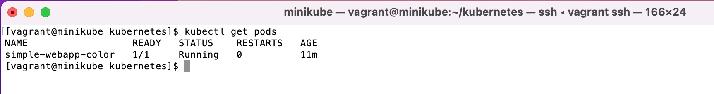
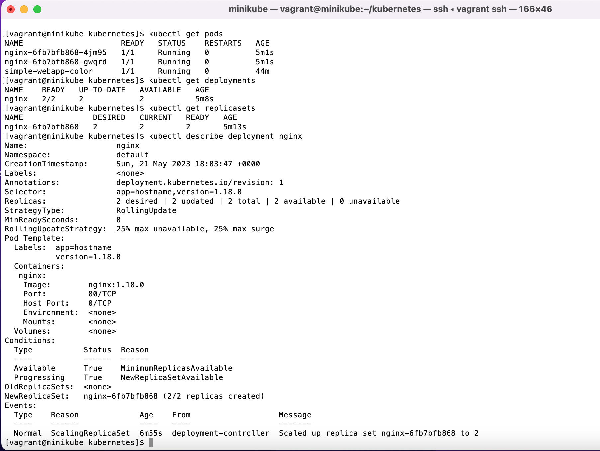
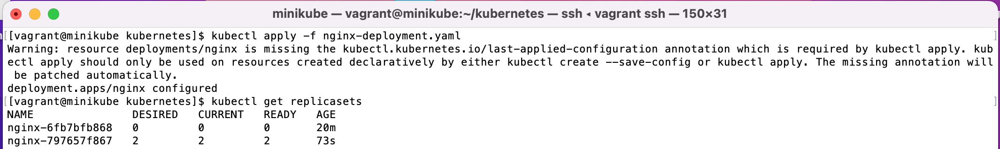
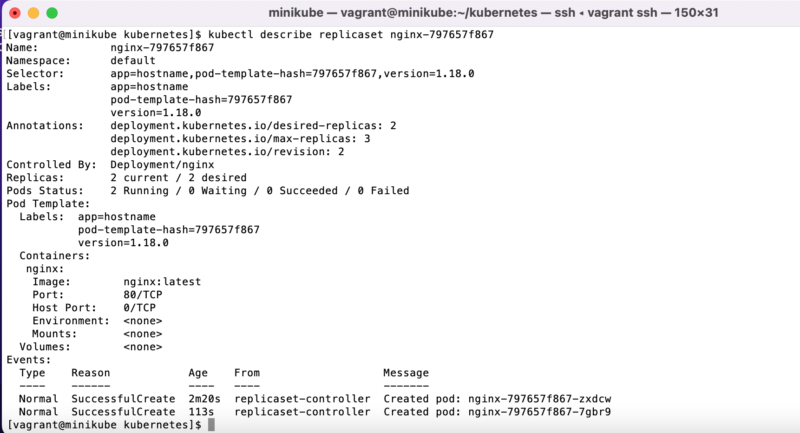
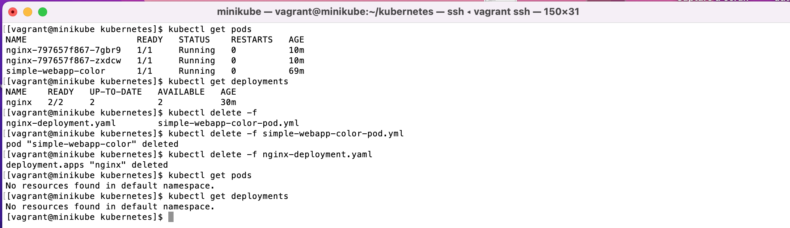
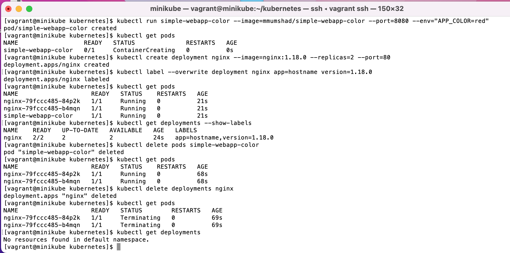

# Bootcamp Devops Eazytraining

## [Module 2 · Kubernetes · Orchestration de conteneurs](https://github.com/jeandonaldroselin/eazytraining-devops-bootcamp-kubernetes) > TP2

Ce TP consiste à déployer nos premières application sur un cluster kubernetes en suivant les étapes suivantes : 

### Exercice 1 

#### Étape 1 : Créer un fichier simple-webapp-color-pod.yaml

Il s'agit de créer un fichier qui contient la définition d'un pod basé sur l'image docker "mmumshad/simple-webapp-color".

Contenu présent dans [simple-webapp-color-pod.yaml](./simple-webapp-color-pod.yaml)

#### Étape 2 : Lancer le prod

En executant la commande suivante : 

```bash
kubectl create -f simple-webapp-color-pod.yaml
```

Puis lister les pods à l'aide de la commande suivante :

```bash
kubectl get pods
```

Vous verrez dans le terminal le contenu suivant qui s'affiche :



#### Étape 3 : Exposer le service 

En executant la commande suivante : 

```bash
kubectl port-forward simple-webapp-color 8080:8080
```

Ouvrir un navigateur et renseigner l'url [http://IP-MACHINE:8080](http://IP-MACHINE:8080), normalement ce contenu s'affiche :


- PS : Je travaille au moment de ce TP sur une VM montée à partir d'un vagrant file, et je trouve mon IP en effectuant la commande suivante dans le terminal de ma VM : 

```bash
ip a
```

Ensuite je cherche la première IP qui s'affiche à côté de enp0s8. 

Si vous avez installé kubernetes sur votre machine en local, veuillez tout simplement remplacer IP-MACHINE par localhost.

### Exercice 2

#### Étape 1 : Créer un fichier nginx-deployment.yaml

Avec le contenu suivant : [voir contenu](nginx-deployment-initial.yaml)

Vous verrez que l'on tente de déployer la version 1.18.0 de nginx.


#### Étape 2 : Lancer le déploiement de nginx

En executant la commande suivante : 

```bash
kubectl create -f nginx-deployment.yaml
```

#### Étape 3 : Vérifier l'état du déploiement

Executer les commandes suivantes

```bash
kubectl get pods
kubectl get deployments
kubectl get replicasets
kubectl get describe deployment nginx
```

Vous devriez observer un résultat similaire à 


#### Étape 4 : Mettre à jour le déploiement

En modifiant la version de nginx dans le fichier avec la version latest (copier le contenu du [fichier suivant](nginx-deployment-latest.yaml) dans votre fichier nginx-deployment.yaml)

Puis lancer la ligne de commande suivante :

```bash
kubectl apply -f nginx-deployment.yaml
```

Vous devriez obtenir le résultat suivant dans la console



#### Étape 5 : Observer les mises à jour effectuées

Executer la commande suivante :

```bash
kubectl get replicasets
```

Vous observerez que vous avez désormais deux réplicasets ! :) (Nous reviendrons sur le pourquoi du comment de cela dans la partie suivante).

Executer ensuite la commande suivante :

```bash
kubectl describe replicaset ${IDENTIFIANT-DE-VOTRE-REPLICATSET}
```
Vous obtiendrez



Vous pouvez constater que la version de nginx présente est bien nginx:latest.

#### Étape 6 : Pourquoi existe t'il deux replicasets ?

Lorsque l'on modifie un déploiement, Kubernetes va

D'une part créer un nouveau replicaset qui contient des réplicats de conteneurs nginx avec la version latest et l'activer.

D'autre part, désactiver mais conserver l'ancien replicaset qui contient les versions 1.18.0 de nginx.

En effet, Kubernetes conserve le replicaset en cas de rollback vers la version précédente d'un déploiement. Pour tester cette théorie, il suffit de remodifier le fichier nginx-deployment.yaml en y remettant le [contenu initial](nginx-deployment-initial.yaml)

Puis de relancer la commande suivante une fois : 

```bash
kubectl apply -f nginx-deployment.yaml
```

Enfin relancer la commande suivante plusieurs fois

```bash
kubectl get replicasets
```

Vous observerez que Kubernetes fait la transition décrite ci-dessus.

#### Étape 7 : Supprimer le pod et le déploiement crées

Executer les commandes suivantes pour nettoyer les pods et déploiements publiés :

```bash
kubectl get pods
kubectl get deployments
kubectl delete -f simple-webapp-color-pod.yaml
kubectl delete -f nginx-deployment.yaml
kubectl get pods
kubectl get deployments
```

Vous devriez obtenir le résultat suivant : 



### Exercice 3

#### Étape 1 : Recréer le pod et le déploiement en lignes de commandes

Executer les commandes suivantes 

```bash
kubectl run simple-webapp-color --image=mmumshad/simple-webapp-color --port=8080 --env="APP_COLOR=red"
kubectl get pods
kubectl create deployment nginx --image=nginx:1.18.0 --replicas=2 --port=80
kubectl label --overwrite deployment nginx app=hostname version=1.18.0
kubectl get pods
kubectl get deployments --show-labels
kubectl delete pods simple-webapp-color
kubectl get pods
kubectl delete deployments nginx
kubectl get pods
kubectl get deployments
```

Vous devriez obtenir le résultat suivant :



PS : En lignes de commandes il faut utiliser une commande à supplémentaire pour labeliser un déploiement.


----

### Divers

2) L'environnement de travail permettant la réalisation de ce TP a été monté avec la configuration vagrant suivante => https://github.com/diranetafen/cursus-devops/tree/master/vagrant/minikube.