# Bootcamp Devops Eazytraining

## [Module 2 · Kubernetes · Orchestration de conteneurs](https://github.com/jeandonaldroselin/eazytraining-devops-bootcamp-kubernetes) > TP3 Ingress

Ce TP consiste à déployer notre premier ingress et appliquer les règles de redirection : 

#### Étape 1 : Créer et déployer un namespace (fichier namespace.yaml)

Il s'agit de créer un fichier qui contient la définition d'un namespace nommé "myingress" pour isoler notre expérience.

Contenu présent dans [namespace.yaml](./namespace.yaml)

Une fois ce fichier crée, executer la commande suivante : 

```bash
kubectl create -f namespace.yaml
kubectl get namespaces
```

Vous devriez obtenir le contenu suivant :

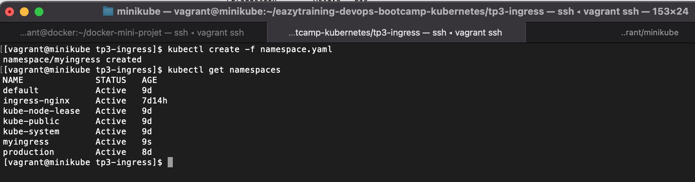

#### Étape 2 : Créer et déployer un pod pour un site bleu (pod-blue.yaml)

Il s'agit de créer un fichier qui contient la définition d'un pod tagué "app:web" basé sur l'image docker "mmumshad/simple-webapp-color" avec la variable d'environnement APP_COLOR à blue. De cette manière un simple site s'affichera avec un fond bleu.

Contenu présent dans [pod-blue.yaml](./pod-blue.yaml)

```bash
kubectl create -f pod-blue.yaml
kubectl get pods --namespace="myingress"
```

Vous devriez obtenir le contenu suivant :

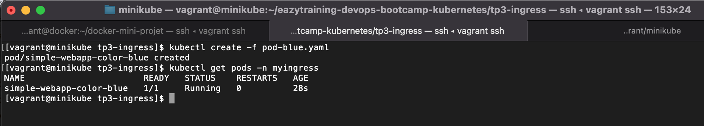

#### Étape 3 : Créer et déployer un pod pour un site rouge (pod-red.yaml)

Il s'agit de créer un fichier qui contient la définition d'un pod tagué "app:web" basé sur l'image docker "mmumshad/simple-webapp-color" avec la variable d'environnement APP_COLOR à red. De cette manière un simple site s'affichera avec un fond rouge.

Contenu présent dans [pod-red.yaml](./pod-red.yaml)

```bash
kubectl create -f pod-red.yaml
kubectl get pods --namespace="myingress"
```

Vous devriez obtenir le contenu suivant :

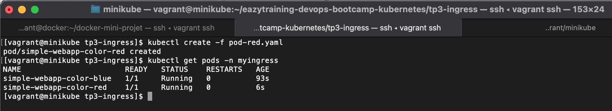

#### Étape 4 : Créer et déployer un service de type cluster IP (service-clusterip-web.yaml)

Il s'agit de créer un fichier qui contient la définition d'un service nommé "service-clusterip-web". Ce service sera responsable d'exposer l'ensemble des pods tagués "app:web".

Contenu présent dans [service-clusterip-web.yaml](./service-clusterip-web.yaml)

En executant la commande suivante : 

```bash
kubectl create -f service-clusterip-web.yaml
kubectl get services --namespace="myingress"
kubectl describe service service-clusterip-web --namespace="myingress"
```

Vous devriez obtenir le contenu suivant :

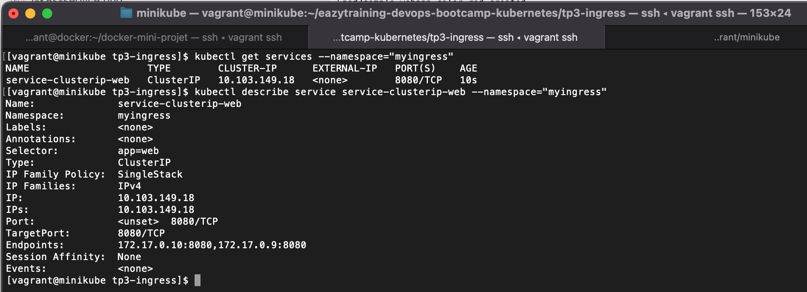

Les deux endpoints listés correspondent aux pods blue et red déployé précédemment.

#### Étape 5 : Activer un ingress NGINX sur le cluster

Tout d'abord, on active le addon ingress sur le cluster et on vérifie son fonctionnement avec les commandes suivantes :

```bash
kubectl addons enable ingress
kubectl get pods -n ingress-nginx
```

Le contenu suivant s'affiche :

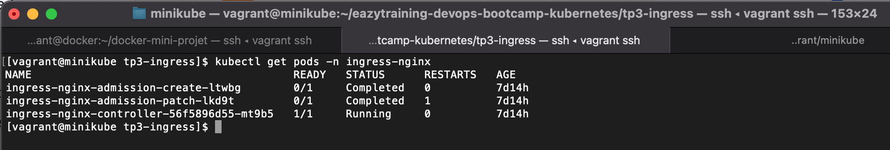


#### Étape 6 : Créer et déployer un ingress NGINX avec une première règle (ingress-web-v1.yaml)

On va définir un ingress nommé "ingress-web".

Cet ingress possèdera une première règle qui consistera à diriger tout le traffic entrant par le nom de domaine "mon-domaine.com" vers le service "service-clusterip-web".

Pour rappel, le service "service-clusterip-web" effectue un load balancing entre le pod red et le pod blue. Ceci peut-etre schématisé de la manière suivante :

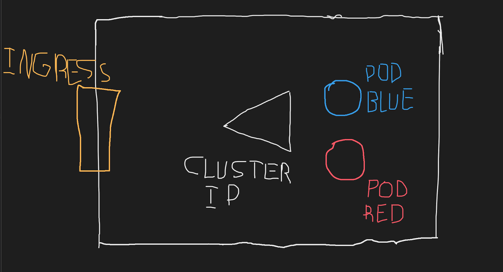

Le contenu est présent dans [ingress-web-v1.yaml](./ingress-web-v1.yaml), lancer les commandes suivantes :

```bash
kubectl apply -f ingress-web-v1.yaml
kubectl -n myingress describe ingress ingress-web
```

Vous obtiendrez un résultat proche de celui-ci

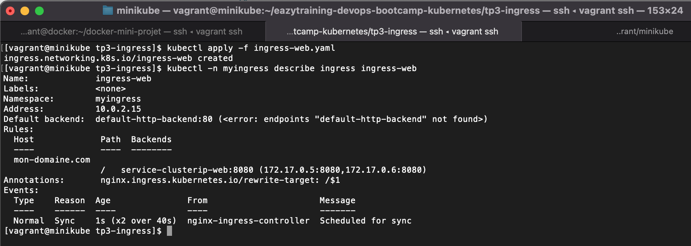

#### Étape 7 : Afficher http://mon-domaine.com (une règle)

Afin d'afficher l'application sur l'url "mon-domaine.com", on va modifier le fichier /etc/hosts de notre machine actuelle.

Il existe deux cas de figure :

1 - Kubectl / Minikube est installé sur votre machine locale

Alors vous renseignez dans le fichier /etc/hosts le contenu suivant :

```bash
localhost   mon-domaine.com
```

2 - Kubectl / Minikube est installé sur une VM (comme moi)

Je travaille au moment de ce TP sur une VM montée à partir d'un vagrant file, et je trouve mon IP en effectuant la commande suivante dans le terminal de ma VM :

```bash
ip a
```

Je cherche la première IP qui s'affiche à côté de enp0s8 et ensuite je renseigne le fichier /etc/hosts avec le contenu suivant en prenant soin de remplacer {IP-MACHINE} par l'IP obtenue.

```bash
{IP-MACHINE}    mon-domaine.com
```

Enfin, ouvrez un navigateur et renseigner l'url [http://mon-domaine.com](http://mon-domaine.com), normalement ce contenu s'affiche :

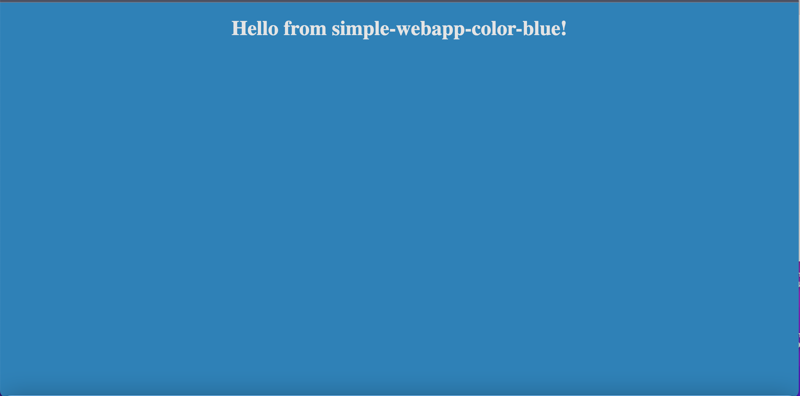

Si vous relancez la même URL (une ou plusieurs fois), le contenu devient celui-là :

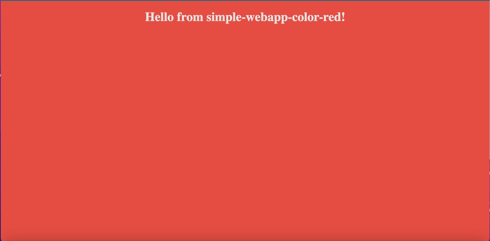

#### Étape 8 : Afficher http://mon-domaine.com/v2 (deux règles)

Une fois le mécanisme en place, nous allons ajouter une règle pour obtenir les règles suivantes :

1 - Diriger tout le traffic entrant par le nom de domaine "mon-domaine.com" sur le prefix "/" vers le service "service-clusterip-web".

2 - Diriger tout le traffic entrant par le nom de domaine "mon-domaine.com" sur le prefix "/v2" vers le déploiement nommé "web2".

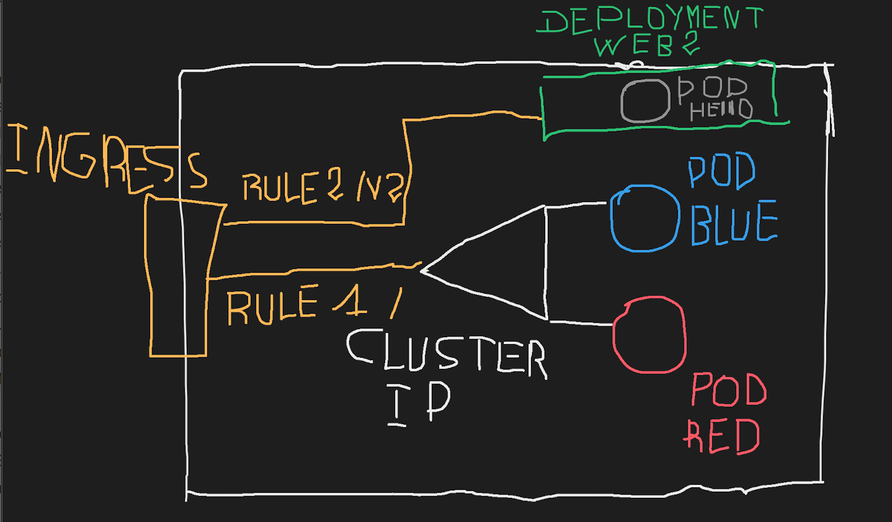

A - Lancer un déploiement du service web2 avec les commandes suivantes :

```bash
kubectl -n myingress create deployment web2 --image=gcr.io/google-samples/hello-app:2.0
kubectl -n myingress expose deployment web2 --port=8080 --type=NodePort
```

Vous obtiendrez un résultat proche de celui-ci

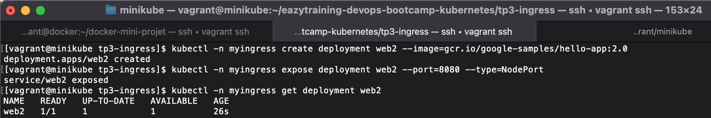

B - Lancer une mise à jour de l'ingress.

Le fichier [ingress-web-v2.yaml](./ingress-web-v2.yaml) contient la nouvelle règle que vous pouvez consulter.

Lancer les commandes suivantes pour mettre à jour l'ingress et afficher les informations actualisées :

```bash
kubectl apply -f ingress-web-v2.yaml
kubectl -n myingress describe ingress ingress-web
```

Vous obtiendrez un résultat proche de celui-ci

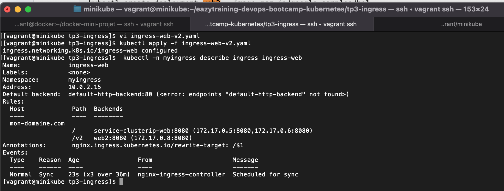

C - Enfin, ouvrez un navigateur et renseigner l'url [http://mon-domaine.com/v2](http://mon-domaine.com/v2), normalement ce contenu s'affiche :

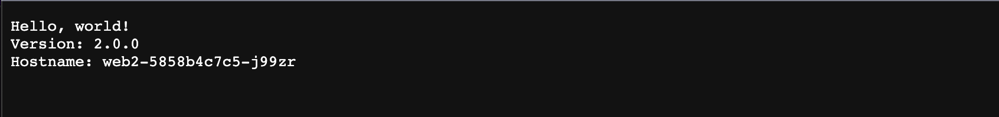

PS : Globalement, l'ingress controlleur peut diriger le traffic vers des pods, des déploiements ou encore des services.

----

### Divers

1) Indications pour l'activation de l'ingress controller https://kubernetes.io/docs/tasks/access-application-cluster/ingress-minikube/


2) L'environnement de travail permettant la réalisation de ce TP a été monté avec la configuration vagrant suivante => https://github.com/diranetafen/cursus-devops/tree/master/vagrant/minikube.
