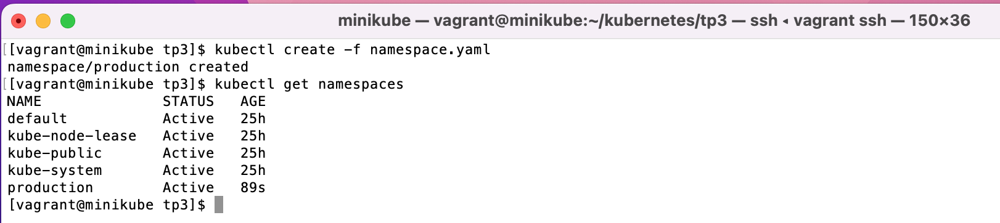
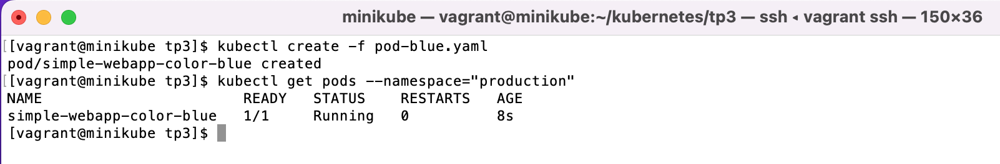
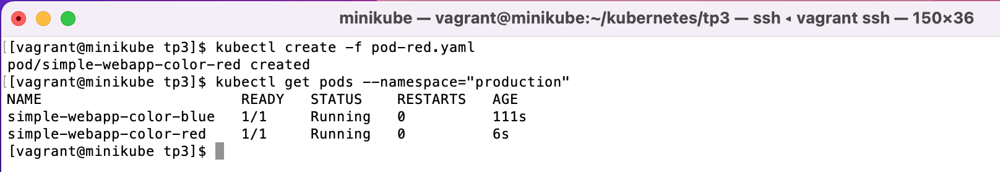
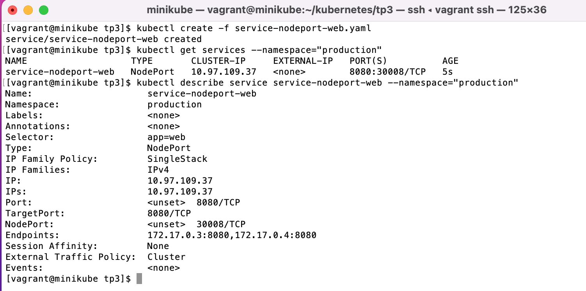
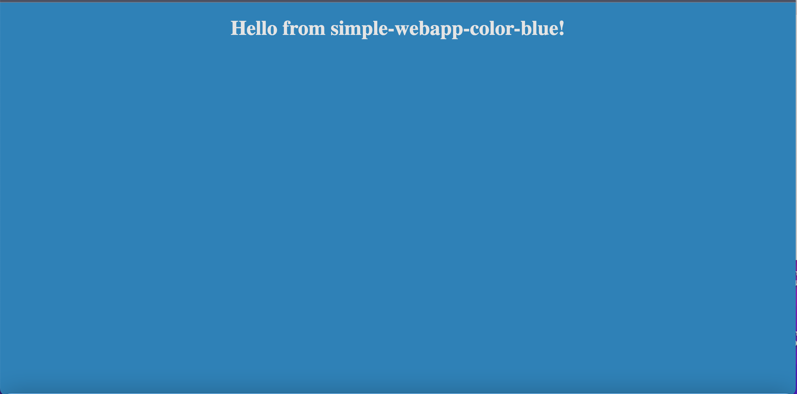
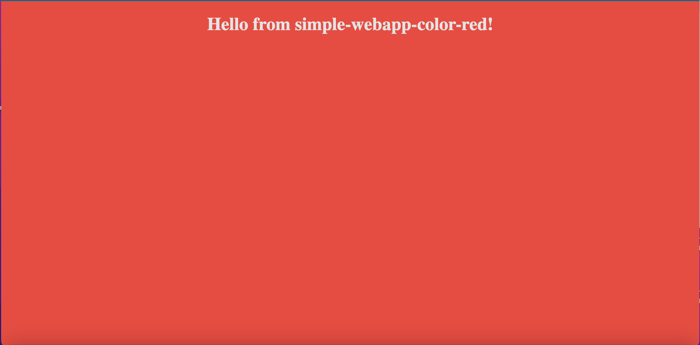

# Bootcamp Devops Eazytraining

## [Module 2 · Kubernetes · Orchestration de conteneurs](https://github.com/jeandonaldroselin/eazytraining-devops-bootcamp-kubernetes) > TP3

Ce TP consiste à déployer nos premier service sur un cluster kubernetes en suivant les étapes suivantes : 

#### Étape 1 : Créer et déployer un namespace (fichier namespace.yaml)

Il s'agit de créer un fichier qui contient la définition d'un namespace nommé "production".

Contenu présent dans [namespace.yaml](./namespace.yaml)

Une fois ce fichier crée, executer la commande suivante : 

```bash
kubectl create -f namespace.yaml
kubectl get namespaces
```

Vous devriez obtenir le contenu suivant :



#### Étape 2 : Créer et déployer un pod pour un site bleu (pod-blue.yaml)

Il s'agit de créer un fichier qui contient la définition d'un pod tagué "app:web" basé sur l'image docker "mmumshad/simple-webapp-color" avec la variable d'environnement APP_COLOR à blue. De cette manière un simple site s'affichera avec un fond bleu.

Contenu présent dans [pod-blue.yaml](./pod-blue.yaml)

```bash
kubectl create -f pod-blue.yaml
kubectl get pods --namespace="production"
```

Vous devriez obtenir le contenu suivant :



#### Étape 3 : Créer et déployer un pod pour un site bleu (pod-red.yaml)

Il s'agit de créer un fichier qui contient la définition d'un pod tagué "app:web" basé sur l'image docker "mmumshad/simple-webapp-color" avec la variable d'environnement APP_COLOR à red. De cette manière un simple site s'affichera avec un fond rouge.

Contenu présent dans [pod-red.yaml](./pod-red.yaml)

```bash
kubectl create -f pod-red.yaml
kubectl get pods --namespace="production"
```

Vous devriez obtenir le contenu suivant :



#### Étape 4 : Créer et déployer un service de type nodePort (service-nodeport-web.yaml)

Il s'agit de créer un fichier qui contient la définition d'un service nommé "service-nodeport-web". Ce service sera responsable d'exposer l'ensemble des pods tagués "app:web".

Contenu présent dans [service-nodeport-web.yaml](./service-nodeport-web.yaml)

En executant la commande suivante : 

```bash
kubectl create -f service-nodeport-web.yaml
kubectl get services --namespace="production"
kubectl describe service service-nodeport-web --namespace="production"
```

Vous devriez obtenir le contenu suivant :



Les deux endpoints listés correspondent aux pods blue et red déployé précédemment.

#### Étape 5 : Afficher l'application

Ouvrir un navigateur et renseigner l'url [http://IP-MACHINE:8080](http://IP-MACHINE:8080), normalement ce contenu s'affiche :



Si vous relancez la même URL (une ou plusieurs fois), le contenu devient celui-là :




- PS : Je travaille au moment de ce TP sur une VM montée à partir d'un vagrant file, et je trouve mon IP en effectuant la commande suivante dans le terminal de ma VM : 

```bash
ip a
```

Ensuite je cherche la première IP qui s'affiche à côté de enp0s8. 

Si vous avez installé kubernetes sur votre machine en local, veuillez tout simplement remplacer IP-MACHINE par localhost.


----

### Divers

2) L'environnement de travail permettant la réalisation de ce TP a été monté avec la configuration vagrant suivante => https://github.com/diranetafen/cursus-devops/tree/master/vagrant/minikube.